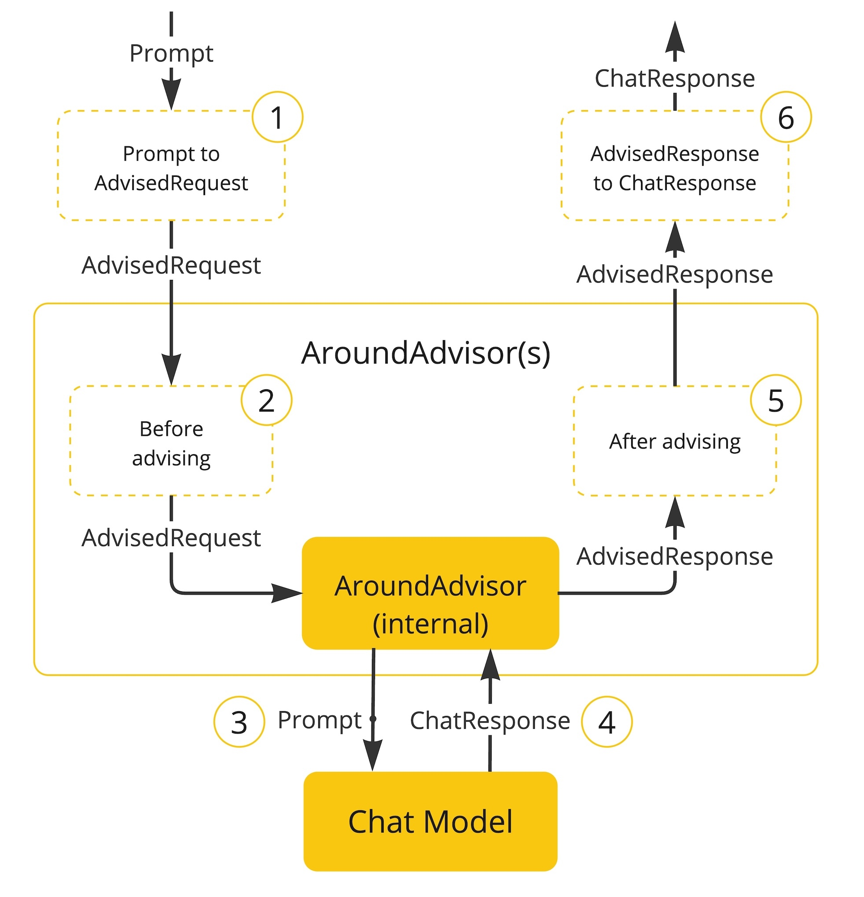

在 Spring AOP（面向切面编程）中，**Advisor** 是核心概念之一。理解 Advisor 有助于掌握 Spring AOP 内部如何组织和执行增强逻辑（Advice）与切点（Pointcut）。

---

## ✅ 一句话理解

> **Advisor = Pointcut（切点） + Advice（通知）**

---

## 🧠 为什么需要 Advisor？

在 Spring AOP 的设计中，`Advice` 表示\*\*“做什么”**（例如：前置、后置、异常通知），而 `Pointcut` 表示**“在哪”\*\*执行这些操作（即哪些方法）。
为了将两者组合起来，Spring 引入了 `Advisor`，把二者打包，交由 AOP 框架统一处理。

---

## 🧱 Advisor 的分类

Spring 提供了一些常用的 `Advisor` 接口和实现类：

| 接口/类                             | 描述                                                    |
| -------------------------------- | ----------------------------------------------------- |
| `Advisor`                        | 顶层接口，只定义了 `Advice getAdvice()`                        |
| `PointcutAdvisor`                | 扩展了 `Advisor`，添加 `Pointcut getPointcut()` 方法          |
| `DefaultPointcutAdvisor`         | 最常用实现类，可以设置 Pointcut + Advice                         |
| `IntroductionAdvisor`            | 用于引入增强（引入接口和实现）                                       |
| `NameMatchMethodPointcutAdvisor` | 根据方法名匹配的 PointcutAdvisor                              |
| `RegexpMethodPointcutAdvisor`    | 正则方式匹配方法的 PointcutAdvisor（基于 JdkRegexpMethodPointcut） |

---

## 💡 示例：使用 DefaultPointcutAdvisor

```java
// 定义 Advice
MethodBeforeAdvice advice = (method, args, target) -> {
    System.out.println("Before method: " + method.getName());
};

// 定义 Pointcut（切入所有以 "save" 开头的方法）
NameMatchMethodPointcut pointcut = new NameMatchMethodPointcut();
pointcut.setMappedName("save*");

// 创建 Advisor
DefaultPointcutAdvisor advisor = new DefaultPointcutAdvisor(pointcut, advice);
```

这段代码创建了一个 Advisor，表示：对所有以 `save` 开头的方法，执行一个前置通知。

---

## 🔄 Spring AOP 执行流程（简化）

1. **注册 Advisor**

   * Spring 通过 `BeanFactory` 获取所有 `Advisor`。
2. **匹配切点**

   * 使用 `Pointcut` 判断目标类的方法是否命中。
3. **生成代理**

   * 如果命中，则为目标类生成代理（JDK Proxy 或 CGLIB）。
4. **织入 Advice**

   * 将 Advice 应用于方法调用过程中。

---

## 📦 自定义 Advisor（可选）

可以通过实现 `PointcutAdvisor` 来创建更复杂的匹配逻辑：

```java
public class MyAdvisor implements PointcutAdvisor {

    private final Pointcut pointcut = new MyPointcut();
    private final Advice advice = new MyAdvice();

    @Override
    public Advice getAdvice() {
        return advice;
    }

    @Override
    public Pointcut getPointcut() {
        return pointcut;
    }

    @Override
    public boolean isPerInstance() {
        return true;
    }
}
```

---

## ✅ 总结重点

| 元素         | 含义                | 角色               |
| ---------- | ----------------- | ---------------- |
| `Advice`   | 通知逻辑              | 做什么（增强内容）        |
| `Pointcut` | 匹配规则              | 什么时候做，在哪做        |
| `Advisor`  | Advice + Pointcut | 把“做什么”和“在哪做”打包起来 |

---

如果你希望深入源码层面，我们也可以继续往下分析 `ProxyFactory`, `AdvisorAdapterRegistry`, `AdvisedSupport` 等组件的作用。需要吗？

作为顾问而言，就是做什么，知道怎么做。

都是在调用模型之前。而不是调用http实际方法之前。所以advisor获取不了原始的数据。
